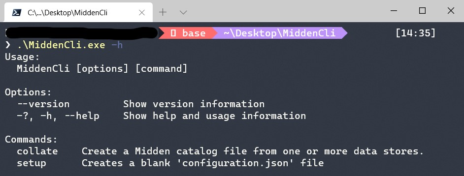
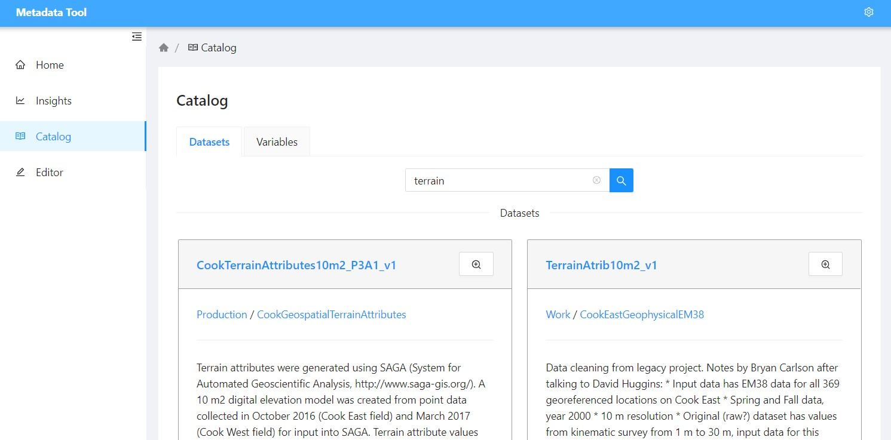
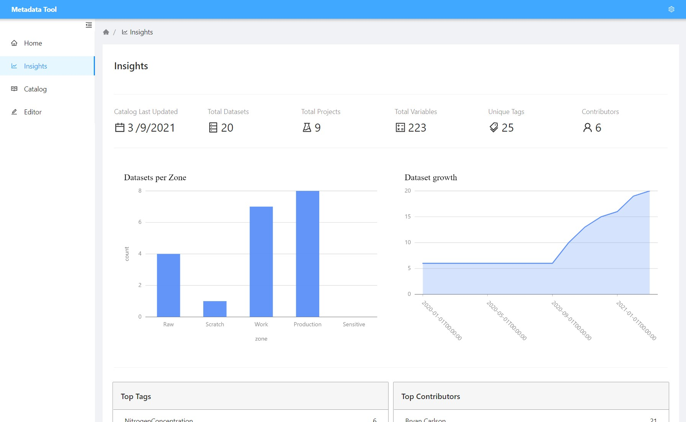

# Midden

**See it in action**: https://meta.cafltar.org

Midden is a data catalog that is easily adaptable to fit within a typical researcher's workflow. Midden solves the problem of "who is collecting X data, and where can I access it?" that is the bane of many large academic research projects.

## Motivation

There are numerous solutions for cataloging data to make it discoverable. Many of these solutions, however, require technical knowledge that is uncommon among academic researchers. Many researchers feel at ease with managing their data workflow through their native filesystem (see [here](https://journals.plos.org/ploscompbiol/article?id=10.1371/journal.pcbi.1005510), [here](https://data.research.cornell.edu/content/file-management), [here](https://data.library.arizona.edu/data-management/best-practices/data-project-organization)). Despite that, many data catalogs require complex solutions that is more typical in teams of data scientists and data engineers.

Midden meets researchers where they are comfortable.

## Overview

Midden is a suite of three tools; an editor, a crawler, and a data catalog. The editor and crawler are static web apps that can be hosted for free from various providers ([Github](https://pages.github.com/), [Azure](https://azure.microsoft.com/en-us/services/app-service/static/), [netlify](https://www.netlify.com/)) and the crawler is a cross-platform command line interface.

### The Editor

Midden has a metadata editor that supports fields common in many standard metadata formats including contact info, data dictionaries, methods, tags, spatial information, and much more.

### The Crawer

Midden has a cross-platform command-line interface with commands to crawl various data stores (local file system, Google Workspace Shared drive, Azure Data Lake Gen 2, more coming soon...) and collates all metadata into a single file.

### The Catalog

Midden supports viewing all metadata through a rich interactive interface that supports global search through datasets and variables.

## The workflow

1. Researcher does magic, creates a dataset
2. Researcher uses the Editor to create metadata then downloads and saves the file with the dataset
3. Researcher (or data manager, or an automated script) runs the Crawler
4. The data catalog is updated with the new metadata
5. Collaborators find data using the Catalog, rejoice

## Screenshots

**Insights Dashboard** shows interesting statistics of your data holdings.

---

**Variable Data Catalog** allows searching for specific variables across all datasets.

---

**Dataset Details** shows all metadata of a given dataset.

---

## Installing

1. Fork the [repository](https://github.com/cafincubator/midden)
2. Create a local clone

    `git clone https://github.com/your-account/midden.git`

3. Make it yours by editing Midden/Caf.Midden.Wam/wwwroot/app-config.json

4. Publish to a free static website host ([Github Pages](https://www.meziantou.net/publishing-a-blazor-webassembly-application-to-github-pages.htm), [netlify](https://swimburger.net/blog/dotnet/how-to-deploy-blazor-webassembly-to-netlify), [Azure Static Web Apps](https://code-maze.com/deploying-blazor-webassembly-into-azure-static-web-apps/))

5. Create metadata, crawl metadata, update catalog.json, push changes to Github, enjoy the envy of your peers.

## Contributing

Please help us make this tool better. We welcome Issues and Pull Requests. Contribution guidelines coming soon...

## License

As a work of the United States government, this project is in the public domain within the United States.

Additionally, we waive copyright and related rights in the work worldwide through the CC0 1.0 Universal public domain dedication.